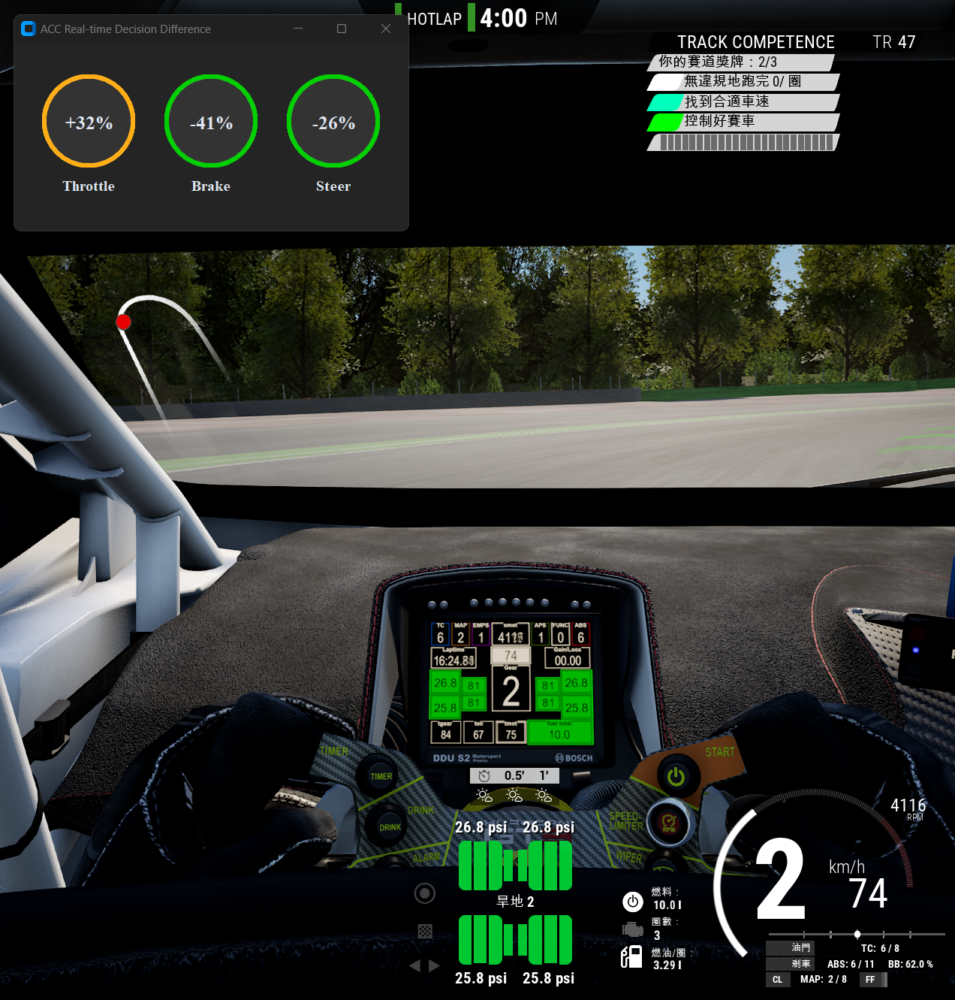

# ACC Telemetry Data Analysis and Reinforcement Learning Driving Agent

This project aims to analyze telemetry data from Assetto Corsa Competizione (ACC) and train a Reinforcement Learning (RL) agent capable of autonomous driving within the game. By collecting and analyzing detailed driving data, we have built a simulation environment to train the RL agent to learn optimal driving strategies.

## Project Goals

*   **Telemetry Data Collection and Analysis**: Extract detailed telemetry data from ACC, such as speed, RPM, tire temperatures, suspension travel, etc., to gain in-depth understanding of vehicle dynamics.
*   **Simulation Environment Construction**: Build a simulation environment suitable for RL training based on ACC telemetry data, accurately reflecting real-world driving conditions.
*   **Reinforcement Learning Agent Training**: Train an RL agent using advanced algorithms like Proximal Policy Optimization (PPO) to learn and execute complex driving policies.
*   **Real-time Decision Comparison**: Develop a user interface (`ACCDrivingOptimization.py`) to display real-time differences between player input and RL agent decisions, providing insights into the agent's behavior.

## Tech Stack

*   **Programming Language**: Python
*   **Reinforcement Learning**: Stable Baselines3 (PPO Algorithm)
*   **Game Interaction**: ACC Shared Memory SDK
*   **User Interface**: CustomTkinter
*   **Data Processing**: NumPy

## Project Structure

The project is organized as follows:

```
.
├── src/                          # Source code
│   ├── ACCController.py
│   ├── ACCDrivingOptimization.py
│   ├── ACCEnv.py
│   ├── ACCTelemetry.py
│   ├── LocalParameters.py
│   ├── main.py
│   ├── RealTimePlot.py
│   └── RLtrain.py
├── scripts/                      # Scripts
│   └── vJoyDisable.bat
├── assets/                       # Assets (images, GIFs, etc.)
│   ├── RL_Training.gif
│   └── ACCDrivingOptimization_UI.png
├── logs/                         # Training logs
│   └── ...
├── models/                       # Trained models
│   └── ...
├── .gitignore
├── README.md
└── requirements.txt
```

**File Descriptions:**

*   **`src/ACCDrivingOptimization.py`**: A GUI application for real-time comparison of player's driving inputs (throttle, brake, steer) against the RL agent's decisions.
*   **`src/ACCController.py`**: Script to control the ACC game, potentially including functions to launch the game, set up tracks, etc.
*   **`src/ACCEnv.py`**: Defines the Reinforcement Learning environment. It handles interactions with ACC, observation of states, calculation of rewards, and execution of actions.
*   **`src/ACCTelemetry.py`**: Script for processing telemetry data obtained from ACC, including data reading, parsing, and transformation.
*   **`src/LocalParameters.py`**: Contains local parameter settings for the project, such as path configurations, model parameters, etc.
*   **`src/main.py`**: The main execution file for the project, possibly serving as an entry point to coordinate different modules.
*   **`src/RealTimePlot.py`**: Script for real-time plotting of telemetry data, facilitating monitoring and analysis.
*   **`requirements.txt`**: Lists all required Python packages for the project and their versions.
*   **`src/RLtrain.py`**: The training script for the Reinforcement Learning agent. It is responsible for setting up the training pipeline, loading the environment, running training loops, and saving models.
*   **`src/test_agent.py`**: Script for testing the performance of a trained RL agent.
*   **`scripts/vJoyDisable.bat`**: A batch file, likely used to disable vJoy virtual joystick devices.
*   **`logs/`**: Directory for storing log files during training, such as TensorBoard event files.
*   **`models/`**: Directory for storing trained Reinforcement Learning models.
*   **`assets/RL_Training.gif`**: GIF showcasing the RL agent's training process.
*   **`assets/ACCDrivingOptimization_UI.png`**: Screenshot of the ACCDrivingOptimization UI.


## Training Process Showcase

Below is a demonstration of the Reinforcement Learning agent's performance during training:

<!-- Insert your training process GIF here -->


## ACCDrivingOptimization UI Showcase

`src/ACCDrivingOptimization.py` provides a real-time user interface that displays the differences between player input and RL agent decisions for throttle, brake, and steer.



## How to Use

1.  **Install Dependencies**:
    Open a terminal and run the following command to install all necessary Python packages:
    ```bash
    pip install -r requirements.txt
    ```
2.  **Start Reinforcement Learning Training**:
    To begin training the RL agent, execute:
    ```bash
    python src/RLtrain.py
    ```
    Training logs will be saved in the `logs/` directory, and trained models will be stored in the `models/` directory.

3.  **Run Real-time Decision Comparison UI**:
    To launch the `ACCDrivingOptimization` UI and observe the decision differences between the player and the agent, run:
    ```bash
    python src/ACCDrivingOptimization.py
    ```
    Ensure that the ACC game is running so the script can connect and fetch telemetry data.
